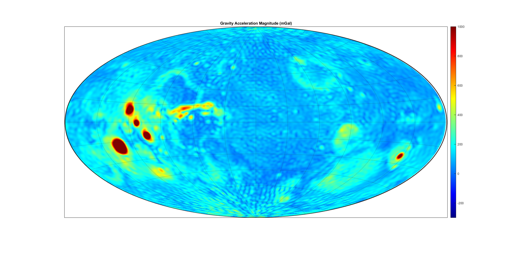

# MatlabSpaceTools

A basic repo of tools I use everyday to do basic space-related things.

- Attitude transformations
- Orbit propagation w/ nonspherical gravity, solar radiation pressure, drag, 3rd body effects
- Spherical harmonics gravity models
- Orbital elements conversions
- Gauss's method, interplanetary transfer solving
 
